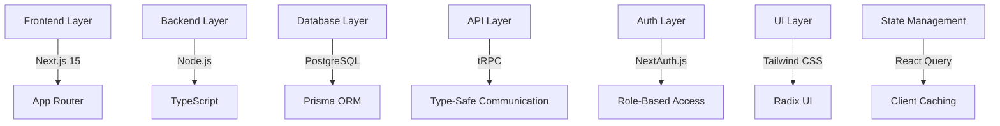
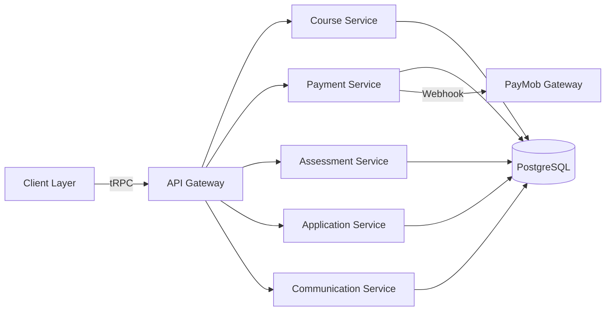
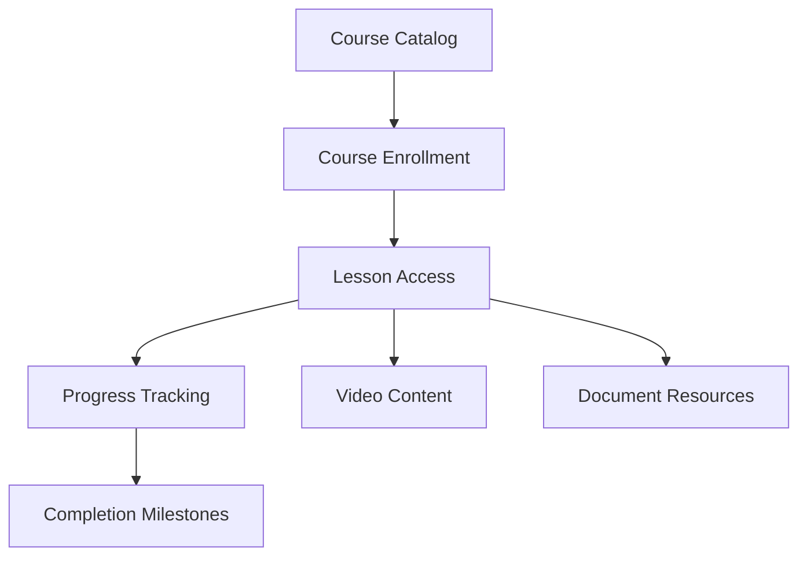
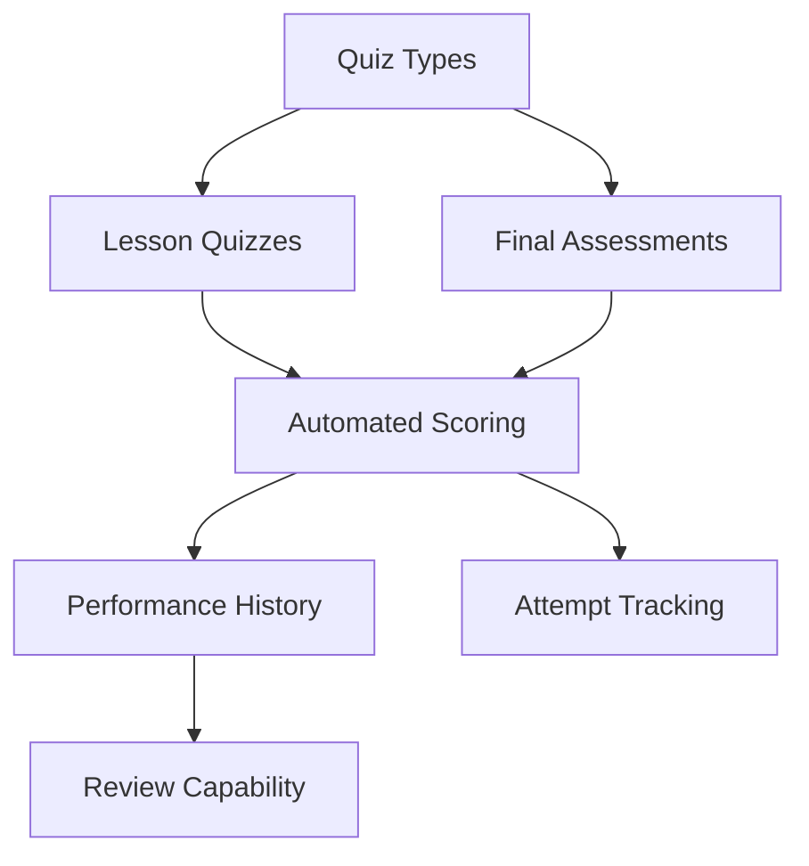
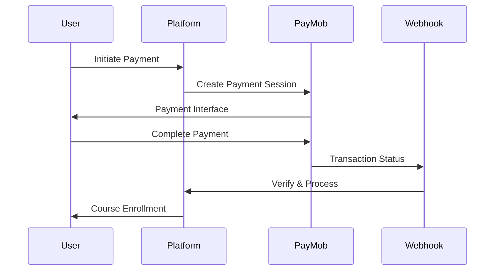
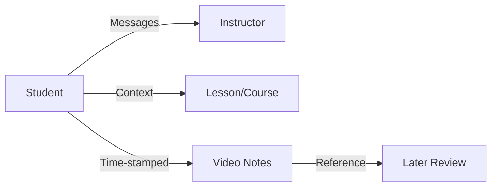
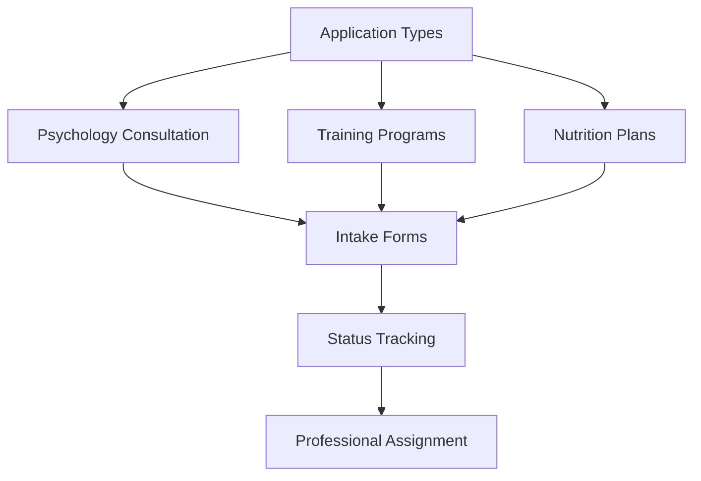
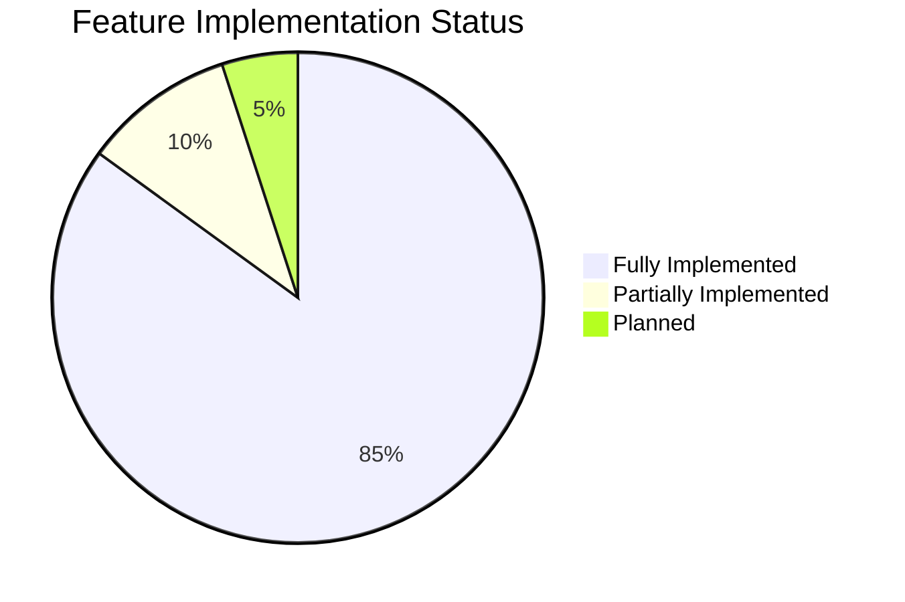
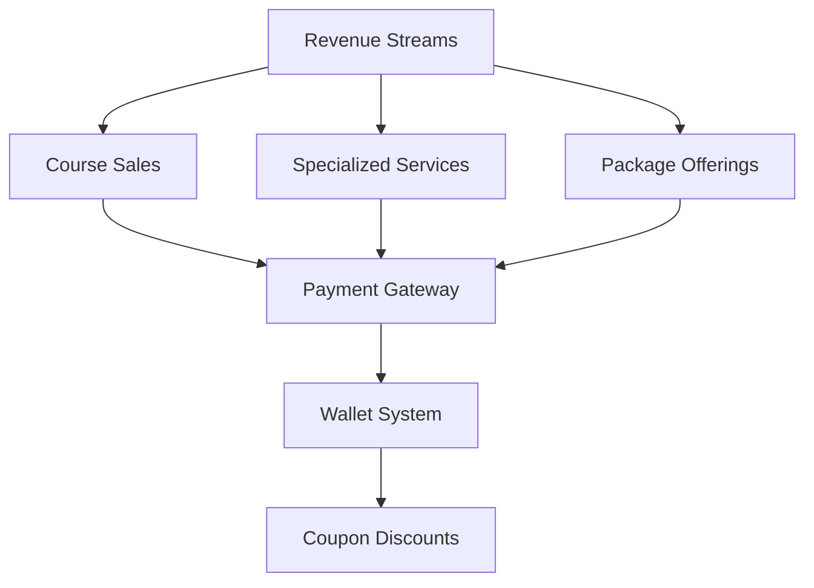

# Edraak Platform - Architecture and Features Overview

## Executive Summary

The Edraak platform is a comprehensive e-learning system designed for sports science education with integrated payment processing, assessment capabilities, and specialized application management. The platform demonstrates sophisticated architecture with well-integrated services across multiple domains.

## Core Architecture

### Technology Stack

| Component | Technology | Purpose |
|-----------|------------|---------|
| Frontend Framework | Next.js 15 with App Router | Server-side rendering and routing |
| Backend Framework | Node.js with TypeScript | Type-safe server logic |
| Database | PostgreSQL with Prisma ORM | Data persistence and querying |
| Authentication | NextAuth.js | Role-based access control |
| API Layer | tRPC | Type-safe API communication |
| State Management | React Query | Client-side caching |
| UI Framework | Tailwind CSS with Radix UI | Responsive component design |

### System Architecture

The platform employs a service-oriented architecture where different functional areas are encapsulated as separate services that interact through well-defined APIs. The system uses tRPC for both server-side and client-side API communication, enabling type-safe operations across the entire stack.

## Feature Categories

### Learning Management System

Core Capabilities:

✅ Comprehensive course management

✅ Lesson organization and structuring

✅ Progress tracking with percentages

✅ Course enrollment system

✅ Multi-format content (video, documents)

✅ Completion tracking

### Assessment and Quizzes

Features:

✅ Lesson-specific quizzes

✅ Final course assessments

✅ Automated scoring engine

✅ Quiz submission system

✅ Performance history tracking

✅ Review capabilities

⚠️ Advanced randomization (partial)

❌ Proctored examinations

### Payment and E-commerce

Payment Features:

✅ PayMob integration

✅ Online card payments

✅ Mobile wallet transactions

✅ User wallet system

✅ Coupon management

✅ Automated cashback

✅ Webhook processing (HMAC verified)

✅ Transaction history

| Payment Method | Status | Features |
|----------------|--------|----------|
| Credit/Debit Cards | ✅ Active | Online processing |
| Mobile Wallets | ✅ Active | Vodafone Cash, etc. |
| Platform Wallet | ✅ Active | Balance management |
| Coupons | ✅ Active | Discount codes |
| Cashback | ✅ Active | Automated rewards |

### Communication and Collaboration

Communication Tools:

✅ Student-instructor messaging

✅ Context-aware conversations

✅ Lesson-specific discussions

✅ Time-stamped video notes

✅ Note reference system

### Specialized Application Management

Application Services:

| Service Type | Status | Features |
|--------------|--------|----------|
| Psychology Consultation | ✅ Complete | Intake forms, tracking, assignment |
| Training Programs | ✅ Complete | Personalized requests, professional review |
| Nutrition Plans | ✅ Complete | Comprehensive forms, expert assignment |

## Security & Access Control

### Role-Based Access Matrix

| Feature | Student | Professor | Administrator |
|---------|---------|-----------|---------------|
| Course Enrollment | ✅ | ❌ | ✅ |
| Content Creation | ❌ | ✅ | ✅ |
| Quiz Taking | ✅ | ❌ | ✅ |
| Quiz Creation | ❌ | ✅ | ✅ |
| Payment Processing | ✅ | ❌ | ✅ |
| User Management | ❌ | ❌ | ✅ |
| Application Review | ❌ | ✅ | ✅ |
| System Configuration | ❌ | ❌ | ✅ |

Security Measures:

✅ NextAuth.js authentication

✅ Role-based authorization

✅ Secure session management

✅ HMAC webhook validation

✅ Multi-layer payment verification

✅ Database transaction integrity

## Feature Completeness Analysis

### Implementation Status

### Fully Implemented Services ✅

Payment processing with PayMob integration

Quiz system with scoring and history

Messaging and note-taking systems

Multi-role authentication and authorization

Admin dashboard with comprehensive management tools

Application forms for specialized services

Course management and enrollment systems

Wallet system with transaction history

### Partially Implemented Services ⚠️

**Certificate System:**

✅ Database structure complete

✅ Metadata schema defined

✅ Milestone creation at 100% completion

❌ Automatic certificate generation

❌ Certificate distribution workflow

❌ PDF generation pipeline

### Planned Enhancements 🔄

Advanced quiz randomization for final exams

Proctored examination capabilities

Complete certificate generation and distribution system

## Business Model Integration

Revenue Streams:

✅ Course sales

✅ Psychology consultation applications

✅ Training program packages

✅ Nutrition plan services

✅ Promotional campaigns via coupons

## Operational Readiness

### System Monitoring

| Component | Status | Capability |
|-----------|--------|------------|
| Logging | ✅ | Comprehensive event tracking |
| Error Handling | ✅ | Structured error responses |
| Webhook Processing | ✅ | Reliable payment integration |
| Data Backup | ✅ | PostgreSQL procedures |
| High Availability | ✅ | Designed for uptime |

### Performance Optimization

✅ Next.js App Router with Server Components

✅ Caching strategies implemented

✅ Database indexing for efficient queries

✅ CDN integration for media assets

✅ React Query for client-side optimization

## Conclusion

The Edraak platform represents a mature and comprehensive e-learning solution that successfully integrates educational content delivery, payment processing, and specialized service applications. The architecture demonstrates careful consideration of security, scalability, and user experience requirements while maintaining a modular design that allows for future enhancements.

System Strengths:

✅ Robust payment processing

✅ Comprehensive role-based access

✅ Well-integrated service architecture

✅ Multiple revenue stream support

✅ Scalable infrastructure

Primary Gap:

⚠️ Certificate generation system requires automated issuance workflow implementation

The platform is production-ready with clear pathways for completing the remaining certificate automation features.