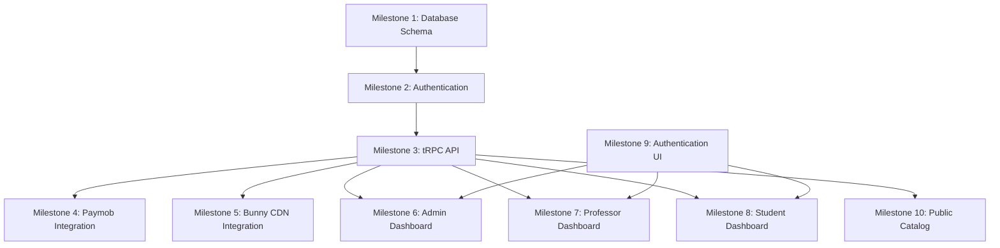

# Edrak Project Plan

## Overview

This document outlines the complete implementation plan for the Edrak educational platform, organized into milestones that build upon each other to create a fully functional MVP.

## Project Structure

```
project-milestone/
├── README.md
├── PROJECT_PLAN.md
├── database/
│   └── milestone-1-database-schema.md
├── backend/
│   ├── milestone-2-authentication.md
│   └── milestone-3-trpc-api.md
├── integrations/
│   ├── milestone-4-paymob-integration.md
│   └── milestone-5-bunny-cdn-integration.md
├── frontend/
│   ├── milestone-6-admin-dashboard.md
│   ├── milestone-7-professor-dashboard.md
│   ├── milestone-8-student-dashboard.md
│   ├── milestone-9-authentication-ui.md
│   └── milestone-10-public-catalog.md
```

## Implementation Approach

We'll follow the APCE methodology:

1. **Analyze** - Understand requirements thoroughly
2. **Plan** - Create detailed implementation plan
3. **Confirm** - Get approval before implementation
4. **Execute** - Implement with clean, minimal code

## Milestone Dependencies



## Detailed Milestone Plan

### Phase 1: Foundation (Weeks 1-2)

1. **Milestone 1: Database Schema Design**

   - Design and implement complete database schema
   - Create Prisma models for all entities
   - Define relationships and constraints

2. **Milestone 2: Authentication System**
   - Implement NextAuth.js with credentials provider
   - Create user registration and login functionality
   - Implement role-based access control

### Phase 2: Core API (Weeks 3-4)

3. **Milestone 3: tRPC API Layer**
   - Set up tRPC with Next.js
   - Implement all backend procedures
   - Add middleware for authentication and validation

### Phase 3: Integrations (Weeks 5-6)

4. **Milestone 4: Paymob Payment Integration**

   - Implement payment processing with Paymob
   - Handle credit card and mobile wallet payments
   - Manage payment callbacks and status updates

5. **Milestone 5: Bunny CDN Integration**
   - Implement file upload to Bunny CDN
   - Create attachment management system
   - Handle file downloads and deletions

### Phase 4: Frontend Implementation (Weeks 7-10)

6. **Milestone 9: Authentication UI**

   - Create role-based sign-in pages
   - Implement registration flow
   - Add password reset functionality

7. **Milestone 6: Admin Dashboard**

   - Build complete admin interface
   - Implement user, course, and payment management

8. **Milestone 7: Professor Dashboard**

   - Create course and lesson management for professors
   - Implement content creation tools

9. **Milestone 8: Student Dashboard**

   - Build learning interface for students
   - Implement enrollment and progress tracking

10. **Milestone 10: Public Catalog**
    - Create public course browsing interface
    - Implement anonymous enrollment flow

## Technology Stack Implementation

### Backend

- **Next.js API Routes** - For authentication and webhook handling
- **tRPC** - Type-safe API layer
- **Prisma** - Database ORM
- **NextAuth.js** - Authentication
- **Zod** - Input validation

### Frontend

- **Next.js App Router** - Page routing
- **Tailwind CSS** - Styling
- **shadcn/ui** - UI components
- **React Hook Form** - Form handling
- **React Query** - Data fetching

### Integrations

- **Paymob** - Payment processing
- **Bunny CDN** - File storage and delivery

## Quality Assurance

### Testing Strategy

- Unit tests for all API procedures
- Integration tests for critical flows
- End-to-end tests for user journeys
- Accessibility testing
- Performance testing

### Code Quality

- TypeScript for type safety
- ESLint for code linting
- Prettier for code formatting
- Commit hooks for code quality enforcement

## Deployment Considerations

### Environment Setup

- Development, staging, and production environments
- Environment-specific configuration
- CI/CD pipeline setup

### Security Measures

- HTTPS enforcement
- Input validation and sanitization
- Authentication and authorization
- Rate limiting
- Security headers

## Success Metrics

### MVP Completion Criteria

- [ ] Users can register, login, and authenticate based on role
- [ ] Admins can manage users, courses, and payments
- [ ] Professors can create and manage courses and lessons
- [ ] Students can browse courses, enroll, and access content
- [ ] Anonymous users can browse courses and initiate enrollment
- [ ] Payments process correctly through Paymob
- [ ] Files upload and download through Bunny CDN
- [ ] All role-based access controls work correctly

### Performance Targets

- Page load times under 2 seconds
- API response times under 500ms
- 99% uptime
- Mobile-responsive design

## Risk Mitigation

### Technical Risks

- Paymob integration complexity - Plan for alternative payment providers
- Bunny CDN upload limitations - Implement resumable uploads
- Database performance - Implement proper indexing and caching
- Authentication security - Follow best practices and regular audits

### Timeline Risks

- Scope creep - Stick to MVP requirements
- Integration delays - Build mock implementations for testing
- Resource constraints - Prioritize critical features first

## Next Steps

1. Review and confirm this project plan
2. Begin implementation with Milestone 1: Database Schema
3. Follow the phased approach outlined above
4. Conduct regular progress reviews
5. Adjust plan as needed based on implementation findings
